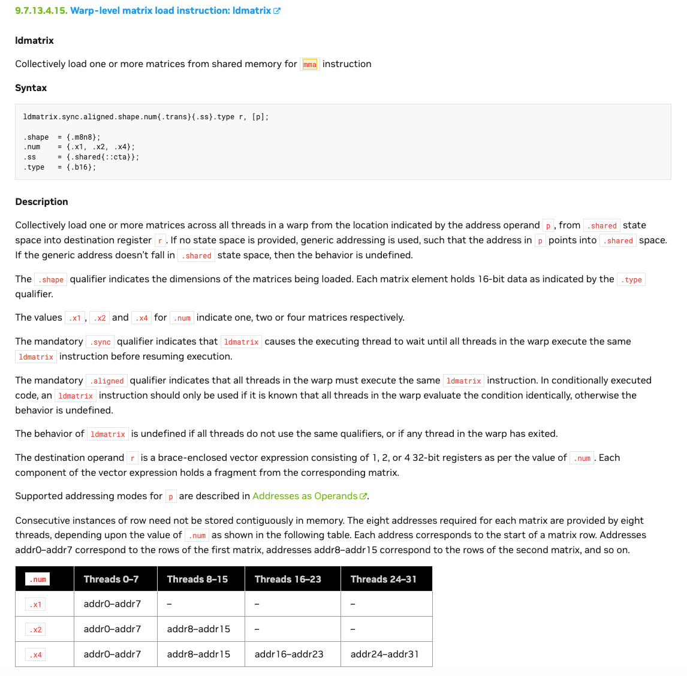

`make debug`: print all information through the mma process

`make`: build release, check result


## mma.m8n8k16.s8u8

following description indicates restriction for instruction `mma.sync.aligned.shape.row.col{.satfinite}.s32.atype.btype.s32 d, a, b, c;`
> .shape   = {.m8n8k16, .m16n8k16, .m16n8k32}
> .atype   = {.u8, .s8};
> .btype   = {.u8, .s8};

the mma shape is related to matrix dtype, for instance, `m8n8k16` mma shape is only supported dtype of `s8/u8` so far.

### src A

the image below describe requirement of data in each thread register 

source matrix A is 8 rows and 16 cols, of which elements is s8 or u8 dtype, 1 Byte. `thread_0` load the elements at row 0 and col from 0 to 3 into its register, a `.b32` register. `thread_1` load at row 0 and col from 4 to 7 into its register.


in order to load the matrix, we use `ldmatrix` PTX code.



there are few indicator should be looked out:

1. `.shape` qualifier indicates the matrix shape going to load, only `m8n8` available. **EVEN IF** `m8n8` isn't identical to the shape of source A in inst `mma`, each element holds `.type` size, which is `.b16` in this case. you may find out in case of `s8/u8` dtype requried for `m8n8k16 mma`, `m8n8` is identical to `m8k16` of `.b16` for source A.

2. `.num`: according to `mma.m8n8k16` description, it calculates one matrix. for one matrix loading, thread_0 to thread_7 gets the 8 row address of matrix. 

```cpp
    unsigned row_src_a = cutlass_get_smem_pointer(src_a + 16 * (threadIdx.x % 8));
    asm volatile("ldmatrix.sync.aligned.m8n8.x1.shared::cta.b16 {%0}, [%1];"
                : "=r"(r_a)
                : "r"(row_src_a));
```

### src B


loading matrix B have lot's of similarities with A. the most convenient methods to loading matrix B is memset the memory to supposed ordering, namely the column-major layout. code like:
```cpp
    unsigned col_src_b = cutlass_get_smem_pointer(src_b + 16 * (threadIdx.x % 8));
    int32_t r_a, r_b;
    asm volatile("ldmatrix.sync.aligned.m8n8.x1.shared::cta.b16 {%0}, [%1];"
                 : "=r"(r_b)
                 : "r"(col_src_b));

    for (int i = 0; i < m8n8k16_src_size; ++i) {
        src_A[i] = i;
        src_B[i] = -1 * (i+1);
    }
```

this methods still ensure that thread_0 get the first 4Bytes of matrix, thread_1 get the second 4Bytes of matrix.
for instance, if the matrix B's data is :

1,2,3,4,5,6,7,...128

the address read from each thread:

|1,2,3,4,5,6,...,16|17,18,...,32|...|
|-|-|-|
|t0|t1|...|

loading result is :

|1,2,3,4|5,6,7,8|...|...|
|-|-|-|-|
|t0|t1|t2|...|

it is same as requirement of matrix B data layout of mma inst. it looks like you decide how to manipulate the mma process. it looks like the matrix B is still rowmajor matrix of row 8 and col 16. BUT, memory is consecutive, the layout is determined by how you interpret it. what you really take care of is to set the thread register data correctly.


### src B another method ldmatrix

considering the ldmatrix supports column major layout, we can initialize the memory to the layout that mma inst required, a really colum major layout matrix.

in this case, ldmatrix would make threads loading elements in column major. what we ensure is data loaded of thread register, that is thread0 load first 4 element of matrix. assume that matrix B's data is 1,2,3,...128.
we should ensure that thread0 load 1,2,3,4.
BUT, because the ldmatrix loading in column major, we should layout this four value in column major, like that:
|col 0(1B)|col1(1B)|...|
|-|-|-|
|1|...|
2|...
3|...
4|...
...

more important, while using ldmatrix, it view the dtype of element of matrix as `b16`. therefore, we will need to put the value 1 and value 2 in the first row, packed as one element of matrix, like that:
|col 0(1B)|col1(1B)|...|
|-|-|-|
|1|2|...|
3|4|..
5|6|...
...

this data layout is view by ldmatrix as following:
|col 0(b16)|col1(16b)|...|
|-|-|-|
|1,2|...|
3,4|..
5,6|...
...

such that, thread0 would load along column major and load value of 1,2,3,4.

one more thing, how to set the address for each thread? as we know, ldmatrix require 8 address for thread0~thread7 while `.num`=`x1`. 

**TODO**: HOW TO INTERPRET THE MEM ADDRESS SETTING WHILE `.trans` enable


```cpp
    unsigned col_src_b = cutlass_get_smem_pointer(src_b + 16 * (threadIdx.x % 8));
    asm volatile("ldmatrix.sync.aligned.m8n8.x1.trans.shared::cta.b16 {%0}, [%1];"
                : "=r"(r_b)
                : "r"(col_src_b));

    for (int i = 0; i < m8n8k16_src_size; ++i) {
        src_A[i]             = i;
        int row_id           = i / 16;
        int row_pivot        = row_id * 2 + 1;
        int col_id           = i % 16;
        int col_group        = col_id / 2;
        int col_group_offset = col_id % 2;
        int value            = row_pivot + col_group * 16 + col_group_offset;
        src_B[i]             = -1 * value;
    }
```